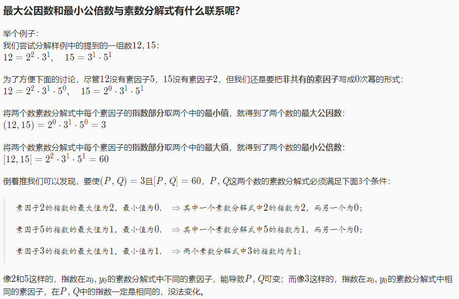
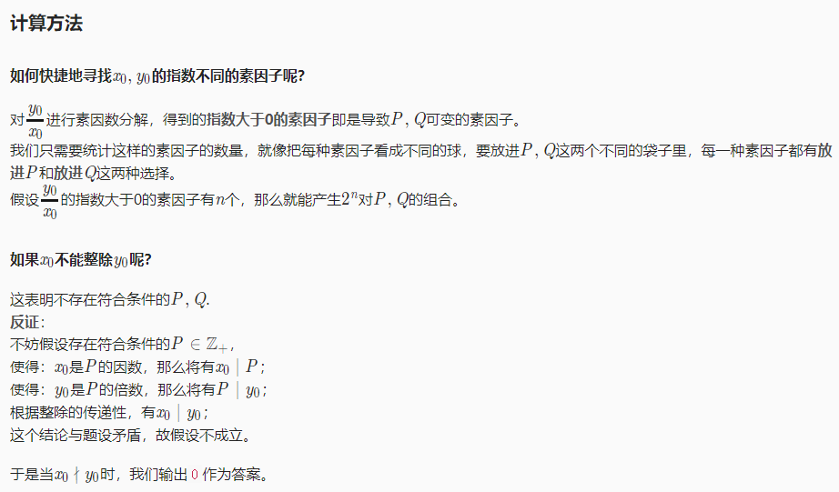

**最大公约数gcd 与 最小公倍数lcm**

欧几里得算法（辗转相除法） gcd(a,b) = gcd(b, a%b)

lcm(a,b) = a / gcd(a,b) * b

```cpp
int gcd(int a,int b){
    if(b == 0) return a;
    return gcd(b,a%b);
}
int lcm(int a,int b){
    int t = gcd(a,b);
    return a/t*b;
}
```

 

 **质因子分解**

[PAT A1059 Prime Factors ](https://pintia.cn/problem-sets/994805342720868352/problems/994805415005503488)

```cpp
#include<iostream>
#include<algorithm>
#include<cmath>
using namespace std;
bool b[10000000];
int prime[100000];
int findprime(int s){  //long int 即 int 
    int n = sqrt(s);
    for(int i=2;i<=n;i++) b[i] = 1;
    for(int i=2;i<=n;i++){
        if(b[i] == 0) continue;
        for(int j=2*i;j<n;j=j+i) b[j] = 0; //一个数的n倍都不是素数 
    }
    int k = 0;
    for(int i=0;i<=n;i++)
        if(b[i] == 1)
            prime[k++] = i;
    return k;
}
struct factor{
    int num;
    int times;
}fac[10]; //由于最小的10个素数乘积大于int能表示的范围
 
int main(){
    int s;
    cin>>s;
    if(s == 1){
        cout<<"1=1";
        return 0;    
    }
    int t = s;
    int k = findprime(s);
    int m = 0;
    for(int i=0;i<k;i++){
        if(s % prime[i] == 0){
            fac[m].times = 0;
            fac[m].num = prime[i];
            while(s % prime[i] == 0){
                fac[m].times++;
                s = s/prime[i];
            }
            m++;    
        }    
    }
    if(s != 1){
        fac[m].num = s;
        fac[m++].times = 1;
    }
    cout<<t<<"=";
    for(int i=0;i<m;i++){
        if(fac[i].times == 1) cout<<fac[i].num;
        if(fac[i].times > 1) cout<<fac[i].num<<"^"<<fac[i].times;
        if(i<m-1) cout<<"*";
    }
    return 0;
}
```


 

应用：

[P1029 最大公约数和最小公倍数问题](https://www.luogu.com.cn/problem/P1029)

```cpp
#include<iostream>
#include<cmath>
using namespace std;
bool b[10000000];
int prime[100000];
int count; 
int findprime(int s){  //long int 即 int 
    int n = sqrt(s);
    for(int i=2;i<=n;i++) b[i] = 1;
    for(int i=2;i<=n;i++){
        if(b[i] == 0) continue;
        for(int j=2*i;j<n;j=j+i) b[j] = 0; //一个数的n倍都不是素数 
    }
    int k = 0;
    for(int i=0;i<=n;i++)
        if(b[i] == 1)
            prime[k++] = i;
    return k;
}
struct factor{
    int num;
    int times;
}fac[10]; //由于最小的10个素数乘积大于int能表示的范围
 
int main(){
    int x,y;
    cin>>x>>y;
    if(y%x != 0){
        cout<<0;
        return 0;
    }
    int s = y/x;
    int k = findprime(s);
    int m = 0;
    for(int i=0;i<k;i++){
        if(s % prime[i] == 0){
            fac[m].times = 0;
            fac[m].num = prime[i];
            while(s % prime[i] == 0){
                fac[m].times++;
                s = s/prime[i];
            }
            m++;    
        }    
    }
    if(s != 1){
        fac[m].num = s;
        fac[m++].times = 1;
    }
    for(int i=0;i<m;i++){
        if(fac[i].times > 0) count++;
    }
    cout<<(1<<count); // 2^count
    return 0;
}
```


题解：（来源https://sochiji.blog.luogu.org/solution-p1029）



