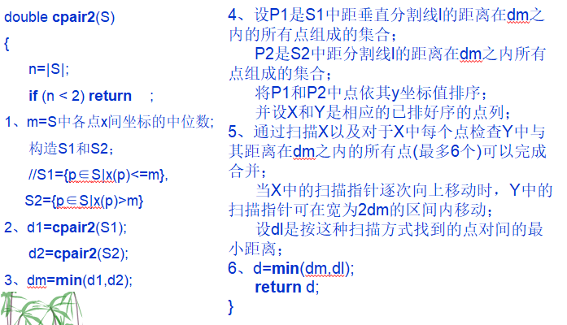

## 一维：

### 算法步骤

1.找出点集的中位数m（最大的数和最小的数的平均值）；

2.将点集分为小于m的数和大于m的数；

**3.左边和右边分别递归求得左边的最小值d1、右边的最小值d2；**

4.记录左边的最大值和右边的最小值，两者之差绝对值为d3；

5.返回d1,d2,d3三者最小值。

### 时间复杂度

分治法时间复杂度 T(n) = 2T(n/2) + O(n)；因此时间复杂度为O(nlogn).

### 代码实现

```cpp
#include<stdio.h>
const int MAXN = 1000000;
double dot[MAXN];
double min3(double a,double b,double c){ //min among 3 numbers
    if(c<=a && c<=b) return c;
    else if(b<=a && b<=c) return b;
    else if(a<=b && a<=c) return a;
}
double maxarr(int l,int r){ //max in an array
    double maxm = dot[l];
    for(int i=l+1;i<=r;i++){
        if(dot[i]>maxm) 
            maxm = dot[i];
    }
    return maxm;
}
double minarr(int l,int r){ //min in an array
    double minn = dot[l];
    for(int i=l+1;i<=r;i++){
        if(dot[i]<minn) 
            minn = dot[i];
    }
    return minn;
}
int partition(double pivot,int lp,int rp){//partition in quicksort
    while(lp < rp){
        while((lp < rp) && (dot[lp] <= pivot)) lp++;
        while((lp < rp) && (dot[rp] >= pivot)) rp--;
        double temp = dot[lp];
        dot[lp] = dot[rp];
        dot[rp] = temp;
    }
    return lp-1;
}
double minpair1(int start,int end){
    //bounds
    if(start == end) return 999999; // only one number
    if(start+1 == end){ //two numbers
        double t = dot[start] - dot[end];
        return t > 0?t : -t;
    }
    //find mid-value
    double ma = maxarr(start,end);
    double mi = minarr(start,end);
    double m = (ma + mi)/2;
    //partition    
    int mid = partition(m,start,end);
    //recursion
    double d1 = minpair1(start,mid);
    double d2 = minpair1(mid+1,end);
    //find the max number in the left & the min number in thr right
    double lmax = maxarr(start,mid);
    double rmin = minarr(mid+1,end);
    double d3 = rmin - lmax;
    return min3(d1,d2,d3);
}

int main(){
    int n;
    scanf("%d",&n);
    for(int i=1;i<=n;i++) scanf("%lf",&dot[i]);
    double dm = minpair1(1,n);
    printf("%llf",dm);
    return 0;
} 
/*----Test----
12
1.5 5.4 2.7 6.8 4.9 9.1 5.6 8.8 0.6 1.9 5.3 6.5
15
1.5 5.4 2.7 6.8 4.9 9.1 5.6 8.8 0.6 1.9 10.3 6.5 12.4 12.6 11.4
*/
```

 

## 二维：

### 算法步骤



 

###  代码实现：

```cpp
#include<stdio.h>
#include<iostream>
#include<math.h>
#include<algorithm>
using namespace std;
const int MAXN = 1000000;
struct Dot{
    double x,y;
}dot[MAXN];

double maxxarr(int l,int r){ //max(x) in an array
    double maxm = dot[l].x;
    for(int i=l+1;i<=r;i++){
        if(dot[i].x>maxm) 
            maxm = dot[i].x;
    }
    return maxm;
}
double minxarr(int l,int r){ //min(x) in an array
    double minn = dot[l].x;
    for(int i=l+1;i<=r;i++){
        if(dot[i].x<minn) 
            minn = dot[i].x;
    }
    return minn;
}
double dist(Dot a,Dot b){
    return sqrt((a.x - b.x)*(a.x - b.x) + (a.y - b.y)*(a.y - b.y));
}
int partition(double pivot,int lp,int rp){//partition in quicksort
    while(lp < rp){
        while((lp < rp) && (dot[lp].x <= pivot)) lp++;
        while((lp < rp) && (dot[rp].x >= pivot)) rp--;
        Dot temp = dot[lp];
        dot[lp] = dot[rp];
        dot[rp] = temp;
    }
    return lp-1;
}
bool cmp(Dot a,Dot b){
    return a.y < b.y;
}
double minpair2(int start,int end){
    //bounds
    if(start == end) return 999999; // only one number
    if(start+1 == end) return dist(dot[start],dot[end]); //two numbers
    //find mid-value of x
    double ma = maxxarr(start,end);
    double mi = minxarr(start,end);
    double m = (ma + mi)/2;
    //partition    
    int mid = partition(m,start,end);
    //recursion
    double d1 = minpair2(start,mid);
    double d2 = minpair2(mid+1,end);
    double dm = d1<d2?d1:d2;
    sort(dot+1,dot+mid,cmp);
    sort(dot+mid,dot+end,cmp);
    double d3 = 9999999;
    for(int i=start;i<=mid;i++){
        for(int j=mid+1;j<=end;j++){
            if(dot[i].x-m<=dm && dot[j].x-m<=dm && 
            dot[j].y-dot[i].y<=dm && dot[j].y-dot[i].y>=-dm){
                double t = dist(dot[i],dot[j]);
                if(t < d3) d3 = t;
            }
        }
    }
    return d3<dm?d3:dm;    
}

int main(){
    int n;
    scanf("%d",&n);
    for(int i=1;i<=n;i++) scanf("%lf %lf",&dot[i].x,&dot[i].y);
    double d = minpair2(1,n);
    printf("%llf",d);
    return 0;
} 
/*----Test----
8
1.5 5.4
2.7 6.8
4.9 9.1
5.6 8.8
1.4 5.3
5.3 6.5
3.4 5.6
2.4 3.4
9
1.5 5.4
2.7 6.8
4.9 9.1
5.6 8.8
0.6 1.9
5.3 6.5
3.4 5.6
2.4 3.4
0.7 1.7
*/
```